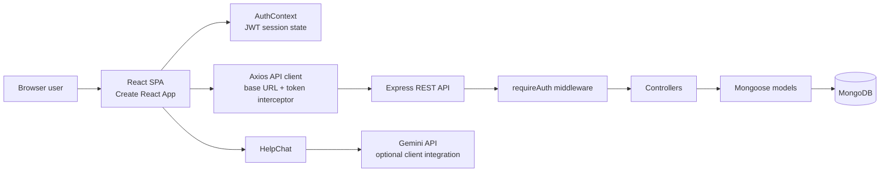
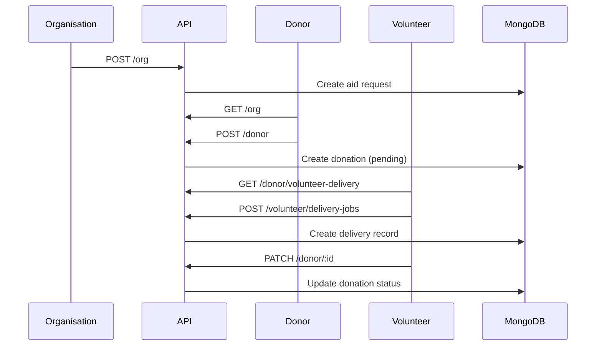

# ZeroHunger

> A role-based food-aid coordination platform that helps organisations request food, donors contribute it, and volunteers deliver it to the people who need it.

[](./client)
[](./server)
[](https://www.mongodb.com/)
[](./server/package.json)

ZeroHunger is aligned with **United Nations Sustainable Development Goal 2: Zero Hunger**. It provides one shared workflow for the organisations that identify food needs, donors who can supply food, volunteers who can transport it, and administrators who oversee platform activity.

**Live:** [zero-ruby-eight.vercel.app](https://zero-ruby-eight.vercel.app)

## Contents

- [1. Product overview](#product-overview)
- [2. Capabilities](#capabilities)
- [3. Architecture](#architecture)
- [4. Technology stack](#technology-stack)
- [5. Repository structure](#repository-structure)
- [6. Core workflows](#core-workflows)
- [7. Authentication and authorization](#authentication-and-authorization)
- [8. API reference](#api-reference)
- [9. Data model](#data-model)
- [10. Local development](#local-development)
- [11. Environment configuration](#environment-configuration)
- [12. Production deployment](#production-deployment)
- [13. Quality and verification](#quality-and-verification)
- [14. Security and operational notes](#security-and-operational-notes)
- [16. Roadmap](#roadmap)

## Product overview

### The problem

Food support is often coordinated across disconnected conversations, spreadsheets, and phone calls. That makes it difficult to match supply with demand, assign delivery responsibility, and understand the current state of a request.

### The solution

ZeroHunger gives each participant a focused workspace:

| Participant | Product responsibility |
| --- | --- |
| Organisation | Publishes food-aid requests and manages active requests |
| Donor | Publishes available food, accepts requests, and tracks donation status |
| Volunteer | Finds delivery opportunities, accepts work, and manages delivery records |
| Administrator | Reviews operational records and manages platform data |

### Product principles

- **Traceability:** each donation and delivery has a visible lifecycle.
- **Role clarity:** users see only the workflows relevant to their role.
- **Low operational friction:** organisations, donors, and volunteers can complete the core flow without switching systems.
- **Responsible access:** API requests require a signed JWT after authentication.

## Capabilities

### Implemented

- Public landing page, login, and signup flows.
- One account model with `organization`, `donor`, `volunteer`, and `admin` roles.
- Password hashing with `bcryptjs`.
- Seven-day JWT sessions.
- Role-aware client routing with `ProtectedRoute`.
- Organisation food-aid request creation, listing, editing, and deletion.
- Donor donation creation, listing, editing, deletion, and donor-specific views.
- Volunteer delivery-job creation, listing, editing, deletion, and volunteer-specific views.
- Donation status progression: `pending`, `accepted`, `in-transit`, `delivered`.
- Admin approval-record management.
- API health endpoint with database connectivity status.
- Responsive React UI with shared navbar, footer, and help chat.
- Optional Gemini-powered help chat in the client.

### Not currently implemented

The following are not represented as production-grade platform features yet:

- Automated email, SMS, or push notifications.
- Payments or donation monetisation.
- File or image uploads.
- Real-time tracking or WebSockets.
- Automated test coverage and CI checks.
- Fine-grained server-side role authorization per route.
- Rate limiting, request validation middleware, and structured logging.

## Architecture

ZeroHunger is a two-application monorepo. The React single-page application communicates with an Express REST API, which persists data in MongoDB through Mongoose.



### Request lifecycle

1. A user signs up or logs in through the React client.
2. The API validates credentials, hashes or compares the password, and returns a seven-day JWT.
3. The client stores the token in `localStorage`.
4. Axios attaches `Authorization: Bearer <token>` to API requests.
5. `requireAuth` verifies the JWT and loads the current user from MongoDB.
6. The controller validates request data and performs the Mongoose operation.
7. The API returns JSON; the client updates the role-specific view.

### Frontend architecture

- `App.js` owns the application shell and route registration.
- `AuthContext` owns login, signup, logout, persisted token state, and role-based home routing.
- `ProtectedRoute` prevents unauthenticated access and redirects users who have the wrong role.
- `api.js` centralises the API URL and Axios authentication/error behavior.
- Shared UI lives in `client/src/Components/`.
- Role-specific screens live in `client/src/Pages/<Role>/`.

### Backend architecture

- `server/server.js` loads environment variables, configures Express, mounts routes, and connects to MongoDB.
- `server/routes/` defines resource URLs.
- `server/controller/` contains validation and business logic.
- `server/models/` contains Mongoose schemas.
- `server/middleware/auth.js` verifies bearer tokens and attaches the authenticated user to `req.user`.

The backend is intentionally REST-only. It does not use GraphQL or WebSockets.

## Technology stack

| Concern | Technology |
| --- | --- |
| Frontend | React 18, React Router 6, Axios |
| Frontend tooling | Create React App, `react-scripts` |
| Backend runtime | Node.js |
| API framework | Express 4 |
| Persistence | MongoDB with Mongoose 7 |
| Authentication | JWT with `jsonwebtoken` |
| Password security | `bcryptjs` |
| Cross-origin requests | `cors` |
| Assistant | Gemini integration through the client help chat |
| Frontend hosting | Vercel-compatible static deployment |

## Repository structure

```text
ZeroHunger/
├── client/
│   ├── public/                     # Static browser assets
│   ├── src/
│   │   ├── api.js                  # Axios configuration and interceptors
│   │   ├── App.js                  # Layout and route map
│   │   ├── Components/             # Shared UI and ProtectedRoute
│   │   ├── context/AuthContext.js  # Authentication state
│   │   └── Pages/
│   │       ├── Landing Pages/      # Landing, login, signup
│   │       ├── Organization/      # Food-aid request workflows
│   │       ├── Donor/              # Donation workflows
│   │       ├── Volunteer/          # Delivery workflows
│   │       └── admin/              # Administration workflows
│   ├── .env.example
│   ├── package.json
│   └── vercel.json                 # SPA fallback rewrite
├── server/
│   ├── controller/                 # Resource controllers
│   ├── middleware/auth.js          # JWT authentication middleware
│   ├── models/                     # Mongoose schemas
│   ├── routes/                     # Express routers
│   ├── .env.example
│   ├── package.json
│   └── server.js                   # API entry point
├── AGENTS.md                       # Repository context and engineering guidance
└── README.md
```

## Core workflows

### Food-aid fulfilment flow



### Role navigation

| Role | Home | Management screens |
| --- | --- | --- |
| Organisation | `/organization-home` | `/foodaidrequest`, `/organization-mgmt` |
| Donor | `/donor-home` | `/donor-accept-request`, `/donor-mgmt` |
| Volunteer | `/volunteer-home` | `/volunteer-delivery-accept`, `/volunteer-mgmt` |
| Admin | `/admin-home` | `/admin-accept`, `/admin-mgmt` |

## Authentication and authorization

### API authentication

Public endpoints are signup, login, and health checks. All resource routers are mounted behind `requireAuth` in the current server entry point.

```http
Authorization: Bearer <jwt>
```

The token contains the user ID and expires after seven days. The middleware verifies it and selects the authenticated user's identity and role from MongoDB.

### Client authorization

The client wraps role-specific routes with `ProtectedRoute`:

- unauthenticated users are redirected to `/login`;
- authenticated users with a different role are redirected to that role's home;
- authenticated users with the correct role can render the page.

Client route protection improves UX, but it is not a substitute for server-side role checks. Before production launch, sensitive mutations should also enforce the caller's role and ownership in controllers.

## API reference

The API runs on `http://localhost:4000` by default. All endpoints below except `/api/health`, `/auth/signup`, and `/auth/login` require a bearer token.

### System and authentication

| Method | Endpoint | Purpose |
| --- | --- | --- |
| `GET` | `/api/health` | Returns API status, MongoDB connection state, and timestamp |
| `POST` | `/auth/signup` | Creates a user and returns a JWT |
| `POST` | `/auth/login` | Authenticates a user and returns a JWT |
| `GET` | `/auth/me` | Returns the current authenticated user |

### Organisation requests

Mounted at `/org`.

| Method | Endpoint | Purpose |
| --- | --- | --- |
| `GET` | `/org` | List aid requests |
| `GET` | `/org/:id` | Get one aid request |
| `POST` | `/org` | Create an aid request |
| `PATCH` | `/org/:id` | Update an aid request |
| `DELETE` | `/org/:id` | Delete an aid request |

### Donor donations

Mounted at `/donor`.

| Method | Endpoint | Purpose |
| --- | --- | --- |
| `GET` | `/donor` | List donations |
| `GET` | `/donor/:id` | Get one donation |
| `GET` | `/donor/user-donations/:donorId` | List donations for a donor |
| `GET` | `/donor/volunteer-delivery` | List donations available for delivery |
| `POST` | `/donor` | Create a donation |
| `PATCH` | `/donor/:id` | Update donation details or status |
| `DELETE` | `/donor/:id` | Delete a donation |

### Volunteer delivery jobs

Mounted at `/volunteer/delivery-jobs`.

| Method | Endpoint | Purpose |
| --- | --- | --- |
| `GET` | `/volunteer/delivery-jobs` | List delivery jobs |
| `GET` | `/volunteer/delivery-jobs/:id` | Get one delivery job |
| `GET` | `/volunteer/delivery-jobs/user-jobs/:volunteerId` | List a volunteer's jobs |
| `POST` | `/volunteer/delivery-jobs` | Create a delivery job |
| `PATCH` | `/volunteer/delivery-jobs/:id` | Update a delivery job |
| `DELETE` | `/volunteer/delivery-jobs/:id` | Delete a delivery job |

### Admin records

Mounted at `/admin/approves`.

| Method | Endpoint | Purpose |
| --- | --- | --- |
| `GET` | `/admin/approves` | List admin records |
| `GET` | `/admin/approves/:id` | Get one admin record |
| `POST` | `/admin/approves` | Create an admin record |
| `PATCH` | `/admin/approves/:id` | Update an admin record |
| `DELETE` | `/admin/approves/:id` | Delete an admin record |

### Legacy workout resource

The backend also contains a protected `/api/workouts` CRUD resource and associated model. It is retained for compatibility with the original scaffold and is not part of the core ZeroHunger product workflow.

## Data model

All current core schemas use Mongoose timestamps, which adds `createdAt` and `updatedAt`.

| Collection/model | Important fields | Purpose |
| --- | --- | --- |
| `User` | `email`, hashed `password`, `role`, profile/organisation fields | Shared identity and role |
| `OrgAidRequest` | `orgId`, `orgName`, `requestTitle`, `population`, `dueDate`, location/contact details | Food need published by an organisation |
| `provideDonation` | donor details, donation size, delivery method, location, `status`, volunteer assignment | Food contribution and fulfilment state |
| `Volunteer` | organisation snapshot, donor snapshot, volunteer identity, vehicle/contact details | Denormalised delivery job |
| `Admin` | organisation name, registration number, address, contact details | Legacy/admin approval record |
| `Workout` | `title`, `reps`, `load` | Legacy scaffold resource |

### Donation status lifecycle

```text
pending → accepted → in-transit → delivered
```

The current schema permits these values but does not enforce every business transition in the database. Controllers and UI should be strengthened if strict transition rules are required.

## Local development

### Prerequisites

- Node.js 18+ (the repository environment currently references Node `v22.18.0`)
- npm
- MongoDB running locally or a MongoDB Atlas connection string
- Git

### 1. Clone and enter the project

```bash
git clone <repository-url>
cd ZeroHunger
```

### 2. Configure the server

```bash
cd server
copy .env.example .env
npm install
```

On macOS/Linux, use `cp .env.example .env` instead of `copy`.

Update `server/.env` with a unique local JWT secret and a reachable MongoDB URI.

### 3. Configure the client

```bash
cd ..\client
copy src\.env.example src\.env
npm install
```

Set `REACT_APP_API_URL=http://localhost:4000` for local development.

### 4. Start the applications

Open two terminals:

```bash
# Terminal 1
cd server
npm run dev
```

```bash
# Terminal 2
cd client
npm start
```

Open [http://localhost:3000](http://localhost:3000). Verify the API with [http://localhost:4000/api/health](http://localhost:4000/api/health).

For a production-like backend process, use `npm start` in `server/`.

## Environment configuration

### Server variables

| Variable | Required | Example | Description |
| --- | --- | --- | --- |
| `PORT` | No | `4000` | Express listening port |
| `MONGO_URI` | Yes | `mongodb://localhost:27017/zero_hunger` | MongoDB connection string |
| `JWT_SECRET` | Yes | `replace-with-a-long-random-secret` | JWT signing secret |
| `APP_URI` | No | `http://localhost:4000` | Application/API URL used by deployment configuration |

### Client variables

Create the file at `client/src/.env`. Create React App only exposes variables prefixed with `REACT_APP_` to browser code.

| Variable | Required | Example | Description |
| --- | --- | --- | --- |
| `REACT_APP_API_URL` | Recommended | `http://localhost:4000` | Backend base URL |
| `REACT_APP_APP_URL` | Optional | `http://localhost:3000` | Frontend/application URL |
| `REACT_APP_GEMINI_API_KEY` | Optional | `replace-with-provider-key` | Enables the help assistant integration when used by the UI |

Never commit `.env` files or real credentials. The repository includes `.env.example` templates for local setup.

## Production deployment

### Frontend

The client is a Create React App static build and includes `client/vercel.json` so browser-side routes resolve to `index.html`.

```bash
cd client
npm run build
```

Deploy the generated `client/build/` output using a static host such as Vercel. Configure `REACT_APP_API_URL` in the hosting provider's environment settings to point to the deployed API.

### Backend

Deploy the `server/` directory to a Node-compatible service. Configure:

- `MONGO_URI` for a production database;
- a long, random `JWT_SECRET`;
- `PORT` supplied by the hosting provider when required;
- `APP_URI` for the public backend URL.

The API must be reachable from the deployed frontend, and the CORS policy should be restricted to trusted production origins before launch. The current server uses permissive `cors()` configuration for development.

### Deployment checklist

- [ ] Use a managed MongoDB database with backups enabled.
- [ ] Replace all development secrets.
- [ ] Configure production CORS origins.
- [ ] Confirm the frontend points to the deployed API.
- [ ] Run `GET /api/health`.
- [ ] Create one test account for each role.
- [ ] Exercise the complete donation-to-delivery flow.
- [ ] Review logs and database permissions.

## Quality and verification

### Available commands

```bash
# Client
cd client
npm start       # Development server
npm run build   # Production compilation
npm test        # React test runner

# Server
cd server
npm start       # Start API
npm run dev     # Start API with nodemon
```

The client build is the primary current verification command:

```bash
cd client
npm run build
```

The server package currently does not define automated tests. Add controller and API integration coverage before treating the application as production-ready.

## Security and operational notes

- Passwords are hashed before persistence; plaintext passwords should never be stored.
- JWTs are currently stored in browser `localStorage`. This is convenient for the SPA but should be reviewed against an HttpOnly secure-cookie strategy for high-risk production deployments.
- Add schema validation
- Replace console request logging with structured, redacted logs in production.
- Restrict CORS to the deployed frontend origin.


## Roadmap

### Near term

- Add automated API and component tests.
- Add server-side role and ownership authorization.
- Add request validation, rate limiting, and structured logging.
- Normalize API error responses and introduce a shared API contract.

### Medium term

- Add notifications for new requests, assignments, and status changes.
- Add operational dashboards and impact metrics.
- Add search, filters, and location-aware matching.
- Add audit history for admin and lifecycle changes.

### Long term

- Add real-time delivery status updates.
- Add multilingual and accessibility improvements.
- Add partner onboarding and organisation verification.
- Add analytics for food rescued, deliveries completed, and communities served.

## License

The backend package declares the ISC license. Confirm the intended project-wide license with the maintainers before distributing the complete product or adding third-party assets.
